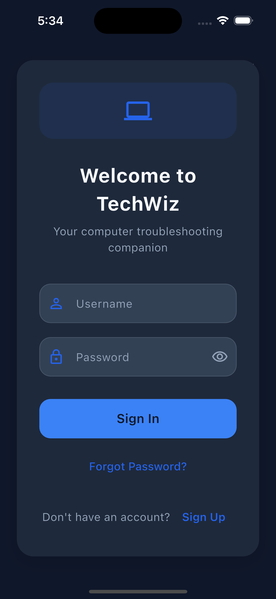
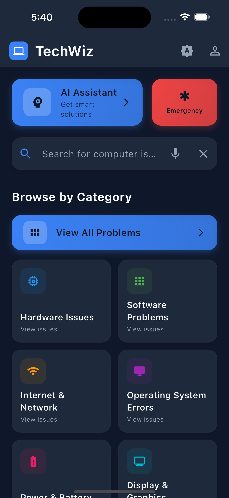
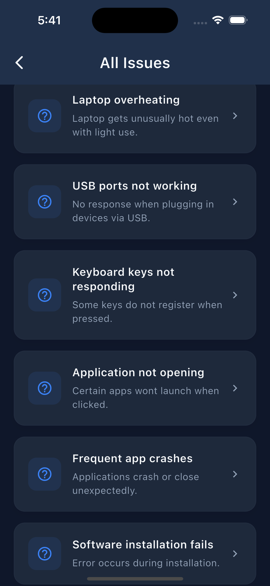
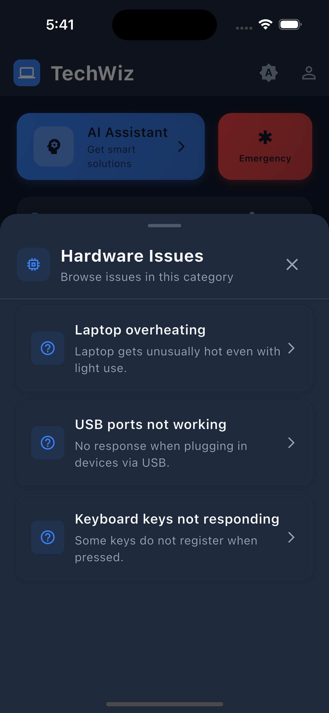
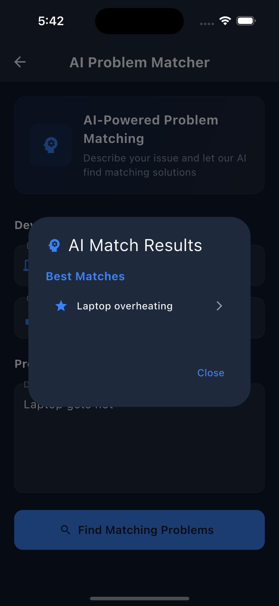
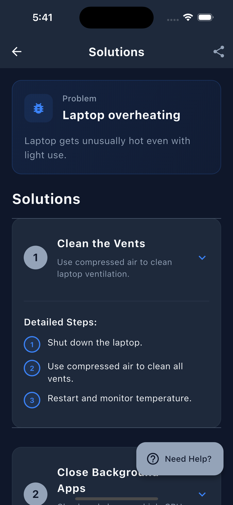

# Techwiz

TechWiz is a mobile app that helps users troubleshoot common computer and laptop issues. Built with a Flutter frontend and a Spring Boot backend, it features secure login and clean architecture. The app now includes a lightweight AI assistant powered by a locally hosted language model (via Ollama), which analyzes user-reported problems and suggests the most relevant fixes from a structured database. Still a work in progress, but it’s steadily evolving into a real-world full-stack project.

## 🚧 Development Status
This project is currently in active development.

## 📱 App Screenshots

### Login & Authentication

### Main Dashboard

### Issue Management

  
  

### AI-Powered Solutions

  
  

